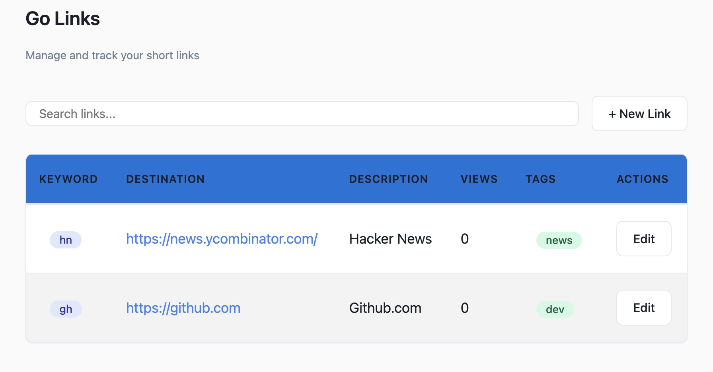

# Golinks

Golinks is an internal URL shortener that organizes your company links into easily rememberable keywords. If you’re on the company network, you can type in <code>go/keyword</code> in your browser, and that will redirect you to the expanded url.



## History of Golinks

Benjamin Staffin at Google developed a golink system that introduced the "go/" domain and allowed Googlers to simply use the shortlink “go/link” in their browser. Benjamin described golinks as "AOL keywords for the corporate network."

## Why

I developed this to scratch my own itch mostly and to learn Go. It was built intending to be run locally on localhost using a sqllite database. It is meant to be lightweight and simple. I was inspired by
@thesephist's [tools](https://thesephist.com/posts/tools/) and the concept of [building software for yourself](https://changelog.com/podcast/455).
The backend API is written in Go and the frontend in Vue.js as a single page app.

## Setup

### Install

Go to the [releases](https://github.com/crhuber/golinks/releases) page and download the latest release.

Or, use my own tool: [kelp](https://github.com/crhuber/kelp)

```bash
kelp add crhuber/golinks --install
```

### Database

Setup a path where you want your golinks sqllite database to live and set the environment variable

```bash
mkdir ~/.golinks
export GOLINKS_DB="$HOME/.golinks/golinks.db"
```

You can also use postgres or mysql database using a valid DSN like:

```bash
export GOLINKS_DBTYPE="mysql"
export GOLINKS_DB="user:pass@tcp(127.0.0.1:3306)/dbname?charset=utf8mb4&parseTime=True&loc=Local"
```

### Run

Run

```bash
golinks serve
```

Use the following flags to configure database, port and static folder

```bash
Flags:
  -d, --db string       DB DSN or SQLLite location path. (default "./data/golinks.db")
  -t, --dbtype string   Database type (default "sqllite")
  -h, --help            help for serve
  -p, --port int        Port to run Application server on (default 8998)
```

All the flags can also be set via environment variables

```bash
GOLINKS_DB
GOLINKS_DBTYPE
GOLINKS_PORT
```

### Run At Startup
To run as an Agent on boot for mac edit and copy the `io.intra.golinks.plist` file to `~/Library/LaunchAgents`  directory.
See [launchd.info](https://www.launchd.info/)

```bash
vi io.intra.golinks.plist
# edit ProgramArguments to location where golinks is installed
cp io.intra.golinks.plist ~/Library/LaunchAgents/
launchctl load ~/Library/LaunchAgents/io.intra.golinks.plist
launchctl start io.intra.golinks
tail -f /tmp/golinks.log
tail -f /private/var/log/com.apple.xpc.launchd/launchd.log
```

### Docker

Build image and run

```bash
docker build . -t crhuber/golinks:latest
docker run -p 8998:8998 crhuber/golinks
```

### DNS Setup

* The automatic way: use [dev-proxy](https://github.com/crhuber/dev-proxy)

* The manual way:

Add a host record to point to your golinks server.
If running locally,  edit your local hostfile:

```
sudo nano /etc/hosts
127.0.0.2       go.internal
```

Add the host suffix to your search domains.
System Preferences>Network>Advanced>DNS>Search Domains:

```
Search Domains:
.internal
```

### Port Redirection Setup

* The browser plugin way: use [Redirector](https://chromewebstore.google.com/detail/redirector/lioaeidejmlpffbndjhaameocfldlhin?hl=en) chrome browser plugin
* The automatic way: use [dev-proxy](https://github.com/crhuber/dev-proxy)

* The manual way:

If you have a local instance of golinks running on your machine, you will need to append the port everytime you want to use golinks in the browser
ie: `go:8998/foo` which is not ideal. To get around this we can run a few hacks.

Create an alias for 127.0.0.2 to point to loopback:

```bash
sudo ifconfig lo0 alias 127.0.0.2
```

To persist this after reboot, edit and copy `io.intra.ifconfig.plist` to system `LaunchDaemons`

```bash
sudo cp io.intra.ifconfig.plist  /Library/LaunchDaemons/
```

Create a port forwarding rule to forward traffic destined for `127.0.0.2:80` to be redirected to local golinks on port 8998

```bash
echo "rdr pass inet proto tcp from any to 127.0.0.2 port 80 -> 127.0.0.1 port 8998" | sudo pfctl -ef -
```

Edit hosts file to modify go.internal to point to 127.0.0.2

```bash
127.0.0.2       go.internal
```

Display current port forwarding

```bash
sudo pfctl -s nat
```

Remove port forwarding

```bash
sudo pfctl -F all -f /etc/pf.conf
```

## FAQ

* How can I see all the links available

    http://go:8998/


* How do programmatic links work?

    Create short links that inject variables by using `{*}`. For example: `gh/{*}` to link to `https://github.com/{*}`.
    So when a user types `gh/torvalds` the `{*}` will be replaced and the browser will be redirected to `https://github.com/torvalds`

## Troubleshooting

- If you change the port of the API. Be sure that you change the frontend index.html to connect to the same port

## Developing

I use [air](https://github.com/cosmtrek/air) for live reloading Go apps.
Just run

```bash
> air

watching .
building...
running...
INFO[0000] Starting server on port :8998
```

## Roadmap


## Contributing

If you find bugs, please open an issue first. If you have feature requests, I probably will not honor it because this project is being built mostly to suit my personal workflow and preferences.
